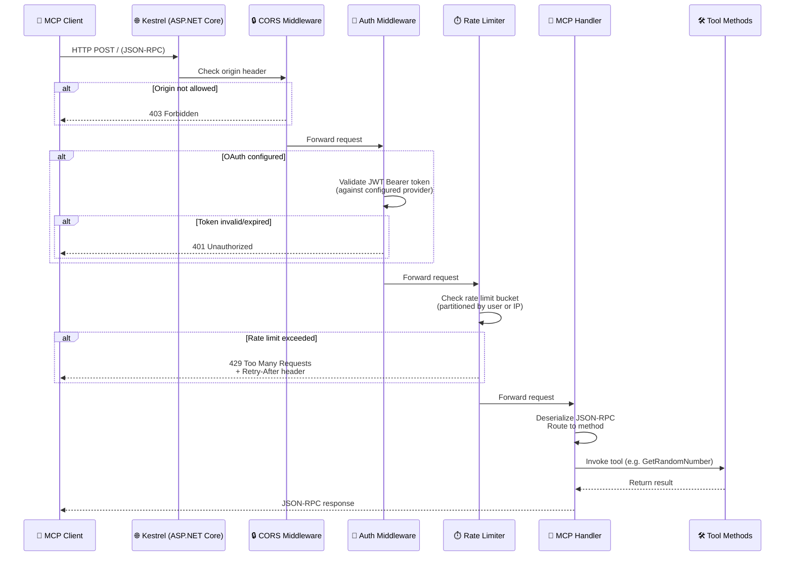
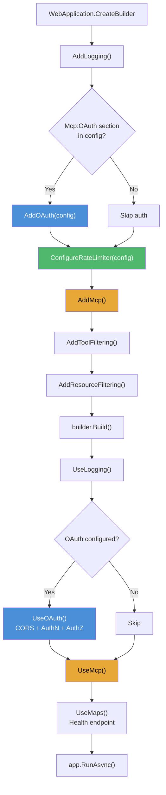
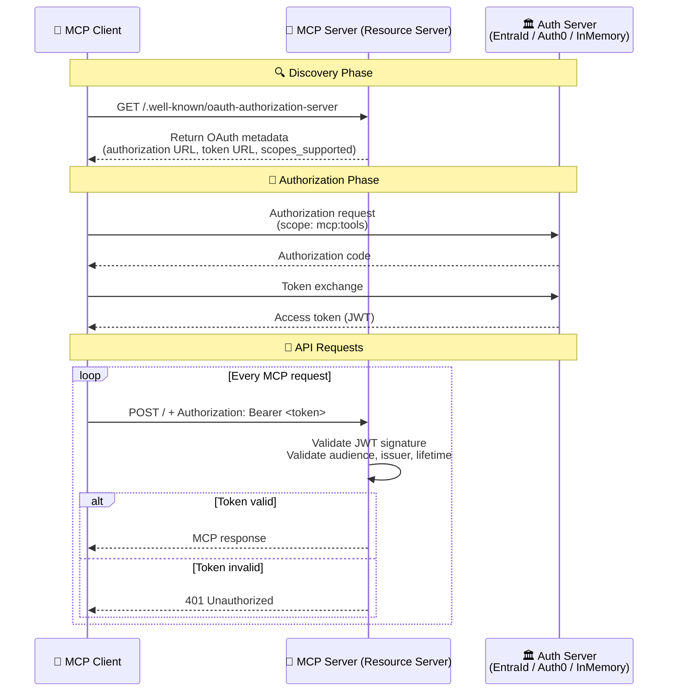
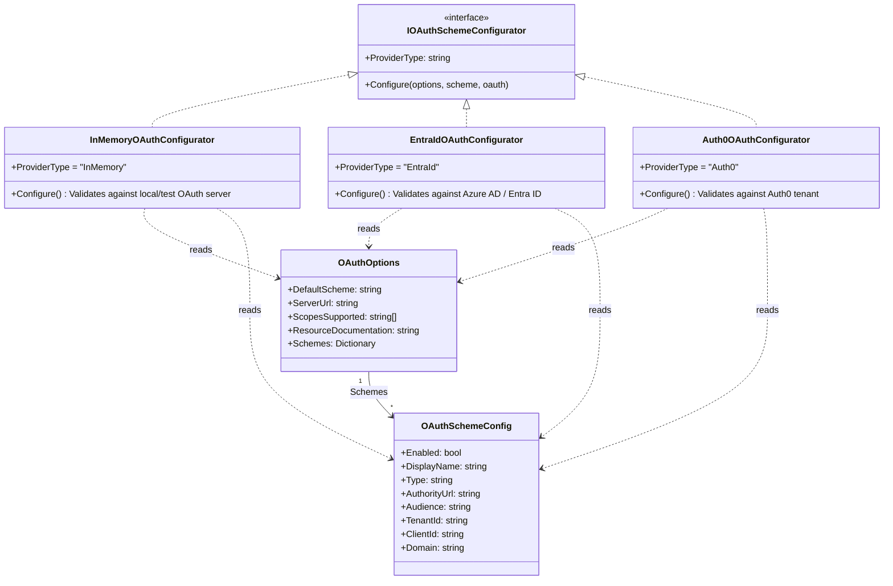
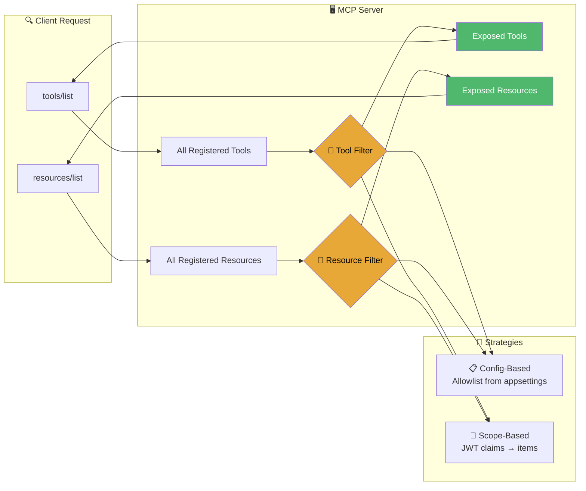

# MCP Primitive Filters

## credits

- [erwinkramer](https://github.com/erwinkramer) is the author of the [bank-api](https://github.com/erwinkramer/bank-api) project. If you don't know the repo, have a look at it. It's a great place to learn many things about writing APIs in AspNetCore.
  - A while back I was in need of refreshing my knowledge about modern .net web APIs and landed on that repo. It has been a huge influence on how I write web apps and a strong guidelie on how to structure my codde.
  - When I contacted erwinkramer about wanting to publish my MCP project that was influenced by what I learned from his repo, he not only told me that is was ok, he even took time to review my repo and gave me a lot of pointers and feedback. He made me realize a lot of things that I hadn't thought of and lead to the decision to rewrite the whole thing from scratch.
- [Mario Zechner](https://mariozechner.at) is the author of the [PI coding agent](https://pi.dev). I love PI because, to me, it emphasizes the importance of keeping the context concise.
  - In some of his blogs, Mario delves into MCP servers and how they clutter your context with information about all the tools that you don't need. (please check out his blog for more info, it was a really good read for me and I think it could be for many other people)
  - What he said resonated with my strong conviction, that controlling the context is something that many people should understand, in order to get better results from AI models: too much might lead to hallucinations, too little might give wrong results.
  - That is why I thought of the idea of having an MCP server, where you could just choose which tools are exposed, to keep your context concise.

## tl;dr

- This repo contains a library that can 
- This repo contains my implementation of an http MCP server, built on top of the [modelcontextprotocol/csharp-sdk](https://github.com/modelcontextprotocol/csharp-sdk), where the exposed tools and resources can be controlled. So you can expose only selected tools/resources from the server, depending on your need or authorization from an enterprise OAuth server.

## What is inside

- A copy of the TestOAuthServer from the csharp-sdk tests, with modifications to show how to control what tools and resources are accessible using scope claims returned by the server.
- An Http MCP server which can inject different strategies to filter the exposed tools and resources
- An example strategy which uses appsettings to control which tools/resources are exposed by the server. (ex. giving someone who runs it locally a direct way to control which tools to show)
- An example strategy using JWT bearer scope claims to filter the tools/resources using the supplied scope claims by the OAuth server. (ex. giving someone in an enterprise setting a way of controlling which tools/resources someone can access)

## Disclaimer

- This is a repo for me to learn more about the sdk, as well as the capabilities of MCP, I try hard to make it "production ready", so if you think something is missing, don't hesitate to create an issue.
- I can't promise to have time for all feedback, but, as long as I do, I will ;-)
- I used AI assisted code generation for the project. The way I use it is more of a "learner". If I get stuck on something, I brainstorm with the agent and I have a solution proposed/implemented, then I go through all generated code and try to understand how it works/propose changes, according to my engineering skills. Once I have a good grasp of what needs to be done, I scratch everything and start anew, with the learnings I have made from the previous run, along with unit and integration tests.
- I have created this code from scratch many times, and only when I reach a point that I am satisfied with, will I have a snapshot upon which I will do the whole rinse-and-repeat cycle all over again.
- This is my first public repo with code that I created. It's scary, but I would be very happy if anyone can use what I learned here to make their lives easier.
- Along with learning about MCP, I have decided to try and use [JJ vcs](https://www.jj-vcs.dev/latest/) for version control.
  - If you don't know anything about JJ, I encourage you to have alook, as it has proven to be really powerful and fun to use. This coming from someone who has been a hardcore git fan, using the awesome [LazyGit client](https://github.com/jesseduffield/lazygit). LazyGit is, for me, the best git client I have ever seen. It has upped my git game in so many ways and I'm forever grateful for Jesse for this amazing tool.

## About the License

- Since it's my first time making a public repo, I am unsure what license to use. I wanted something that is open for people to use, but was thinking that it might be nice to have changes flow back into the repo, in order to help everyone.
- After a bit of research, it was suggested to me, that a MPL-2.0 would do exactly that, so I went with it.
- If you have any input on this, I would be very happy to hear it. I'm a total newbie here.

---

## Quick Tutorial

This guide walks you through getting the Authenticated HTTP MCP Server running, from clone to client connection.

### Prerequisites

- [.NET SDK 10.0](https://dotnet.microsoft.com/download/dotnet/10.0) (or later — the project rolls forward via `global.json`)
- An MCP-compatible client such as the [MCP Inspector](https://github.com/modelcontextprotocol/inspector), [Claude Desktop](https://claude.ai/download), or [Pi](https://pi.dev)
- _(Optional)_ A running OAuth identity provider (Entra ID, Auth0, or the bundled in-memory test server) if you plan to use authenticated access
  - The TestOAuthServer from the [csharp-sdk](https://github.com/modelcontextprotocol/csharp-sdk) is included in the tests directory for local testing

### Step 1: Clone & Build

```bash
git clone https://github.com/your-org/AuthenticatedHttpMcpServer.git
cd AuthenticatedHttpMcpServer

dotnet restore
dotnet build
```

### Step 2: Configure the Server

All server behavior is driven by `appsettings.json` (or environment-specific overrides like `appsettings.Development.json`). The configuration is split into three areas:

#### 2a. HTTP & CORS

```jsonc
// appsettings.json
{
  "AllowedHosts": "localhost;127.0.0.1;[::1]",
  "Mcp": {
    "AllowedOrigins": ["http://localhost:5173"], // browser clients that can POST
  },
}
```

#### 2b. Rate Limiting (optional)

Prevents abuse by limiting requests per user (identified by JWT claim or IP):

```jsonc
{
  "RateLimiterOptions": {
    "Enabled": true,
    "FixedWindowRateLimit": {
      // applies to the GET / health endpoint
      "AutoReplenishment": true,
      "PermitLimit": 40,
      "Window": "00:02:00",
    },
    "McpWindowRateLimit": {
      // applies to the MCP POST endpoint
      "AutoReplenishment": true,
      "PermitLimit": 100,
      "Window": "00:01:00", // 100 requests per 1-minute window
    },
  },
}
```

#### 2c. OAuth Authentication (optional)

If you omit the `Mcp:OAuth` section entirely, the server runs without authentication — all tools are publicly accessible. Add it when you want JWT Bearer protection. Details in the [OAuth settings](#oauth-settings) section below.

### Step 3: Pick Your OAuth Provider (or Skip)

Three providers are built-in. Enable **exactly one** (or none) by setting `"Enabled": true` in `Mcp:OAuth:Schemes`:

| Provider          | Best for           | Required fields                                           |
| ----------------- | ------------------ | --------------------------------------------------------- |
| **InMemory**      | Local dev / demos  | `AuthorityUrl` (point to the TestOAuthServer — see below) |
| **EntraId** (WIP) | Azure / enterprise | `TenantId`, `ClientId`                                    |
| **Auth0** (WIP)   | SaaS identity      | `Domain`, `ClientId`                                      |

**Development quick-start with the test OAuth server:**

The repo includes a `ModelContextProtocol.TestOAuthServer` project that issues its own JWTs. To use it during local development:

```bash
# Terminal 1 — start the OAuth server (defaults to https://localhost:7029)
dotnet run --project tests/ModelContextProtocol.TestOAuthServer

# Terminal 2 — start the MCP server with InMemory auth
dotnet run --project src/McpServer --environment Development
```

The `appsettings.Development.json` already overrides the OAuth section to use `InMemory` with the correct authority URL.

### Step 4: Run the Server

```bash
# Production-style (uses appsettings.json — EntraId by default)
dotnet run --project src/McpServer

# Development-style (uses appsettings.Development.json — InMemory OAuth)
DOTNET_ENVIRONMENT=Development dotnet run --project src/McpServer
```

You should see console output indicating the server has started, along with which OAuth provider is active.

### Step 5: Connect an MCP Client

Point your MCP client at the server's root URL. The server exposes:

| Endpoint                                  | Method | Purpose                                        |
| ----------------------------------------- | ------ | ---------------------------------------------- |
| `/`                                       | `GET`  | Health check — returns `"this is working"`     |
| `/`                                       | `POST` | MCP protocol endpoint (JSON-RPC)               |
| `/.well-known/oauth-authorization-server` | `GET`  | OAuth metadata (only when OAuth is configured) |

**Example MCP client configuration (Claude Desktop / Pi):**

```json
{
  "mcpServers": {
    "authenticated-mcp": {
      "url": "http://localhost:7071/",
      "transport": "streamable-http"
    }
  }
}
```

**With OAuth (standard MCP OAuth flow):**

```json
{
  "mcpServers": {
    "authenticated-mcp": {
      "url": "http://localhost:7071/",
      "transport": "streamable-http",
      "auth": {
        "type": "oauth",
        "authorizationServer": "http://localhost:7071/"
      }
    }
  }
}
```

The client automatically discovers the authorization server metadata and performs the MCP-standard OAuth 2.0 flow. See the [OAuth settings](#oauth-settings) section for what gets advertised.

#### using mcp-inspector

- if using [mcp-inspector](https://github.com/modelcontextprotocol/inspector), you might need to set the NODE_TLS_REJECT_UNAUTHORIZED environment variable to 0 before calling, since node requires special treatment for self-signed certificates

```bash
NODE_TLS_REJECT_UNAUTHORIZED="0" mcp-inspector
```

### Step 6: Call a Tool or Read a Resource

Once connected, ask your AI client to "generate a random number between 1 and 50." The client discovers the available tools and resources automatically.

**Tools** — five example tools are provided: `GetRandomNumber`, `GetTimestamp`, `Echo`, `ListUsers`, and `GetServerStats`. Add your own by following the same pattern in `src/McpServer/Tools/RandomNumberTools.cs`.

**Resources** — four example resources are registered in `src/McpServer/Resources/DemoResources.cs`:

| URI                     | Name         | Description                                                    |
| ----------------------- | ------------ | -------------------------------------------------------------- |
| `server://info`         | Server Info  | Runtime info about the MCP server process                      |
| `system://process-info` | Process Info | Live memory, thread, and CPU metrics                           |
| `weather://{city}`      | City Weather | Simulated weather for any city (template)                      |
| `time://{format}`       | Current Time | UTC time in `iso`, `unix`, `rfc`, or `ticks` format (template) |

### Step 7: Control Which Tools and Resources Are Exposed

This is the core idea of the project. Tools are registered via `WithTools<T>()` and resources via `WithResources<T>()` in `ApiBuilder.Mcp.cs`. To control what clients can see, you have several strategies — all of which apply equally to both tools and resources:

- **Static filtering in code** — add or remove `WithTools<X>()` / `WithResources<X>()` calls to control the total set
- **Configuration-based filtering** — a strategy that reads an allow-list from `appsettings.json` (`Mcp:AllowedTools` / `Mcp:AllowedResources` sections)
- **Scope-based filtering** — a strategy that inspects JWT claims of the form `mcp.tool.{tool_name}` / `mcp.resource.{resource_name}` and only exposes items matching those claims

The scope-based strategy is the most powerful for enterprise setups: your identity provider assigns claims like `mcp.tool.GetRandomNumber` with value `"true"`, and the server dynamically hides tools and resources the caller isn't authorized to see.

---

## Architecture

### Solution Layout

```
AuthenticatedHttpMcpServer/
├── src/
│   └── McpServer/                         # The MCP server application
│       ├── Program.cs                     # Application entry point
│       ├── Infrastructure/                # Cross-cutting concerns, wired via extension methods
│       │   ├── ApiBuilder.Mcp.cs          # MCP server, tool & resource registration
│       │   ├── ApiBuilder.Authentication.cs     # OAuth wiring, scheme configurators
│       │   ├── ApiBuilder.Maps.cs               # Health-check endpoint
│       │   ├── ApiBuilder.RateLimiter.cs        # Rate-limiting policies
│       │   ├── ApiBuilder.ToolFiltering.cs      # Tool filtering strategy registration
│       │   ├── ApiBuilder.ResourceFiltering.cs  # Resource filtering strategy registration
│       │   ├── ApiBuilder.Logging.cs            # Logging setup
│       │   ├── ToolFiltering/             # Pluggable tool & resource visibility strategies
│       │   │   ├── ToolFilteringStrategy.cs              # Tool strategy interface
│       │   │   ├── AppSettingsToolFilteringStrategy.cs   # Config-based tool allowlist
│       │   │   ├── OAuthClaimsToolFilteringStrategy.cs   # JWT claims-based tool filtering
│       │   │   ├── ResourceFilteringStrategy.cs          # Resource strategy interface
│       │   │   ├── AppSettingsResourceFilteringStrategy.cs  # Config-based resource allowlist
│       │   │   └── OAuthClaimsResourceFilteringStrategy.cs # JWT claims-based resource filtering
│       │   └── OAuth/                     # Provider-specific JWT configurators
│       │       ├── IOAuthSchemeConfigurator.cs
│       │       ├── OAuthOptions.cs
│       │       ├── InMemoryOAuthConfigurator.cs
│       │       ├── EntraIdOAuthConfigurator.cs
│       │       └── Auth0OAuthConfigurator.cs
│       ├── Tools/
│       │   └── RandomNumberTools.cs       # Example MCP tools
│       └── Resources/
│           └── DemoResources.cs           # Example MCP resources
├── tests/
│   ├── McpServer.Unit.Tests/              # Unit tests for authentication, rate limiting
│   ├── McpServer.Integration.Tests/       # End-to-end tests using in-memory Kestrel
│   └── ModelContextProtocol.TestOAuthServer/  # Standalone OAuth server for local dev
├── Directory.Packages.props               # Central Package Management
└── Makefile                               # Common task shortcuts
```

### Data Flow

When an MCP client sends a request (e.g. `tools/call` or `tools/list`), the request flows through middleware in the order shown below:



### Startup Pipeline

The `Program.cs` uses a clean fluent builder pattern. Each `Add*` / `Use*` extension method wires one cross-cutting concern:



### OAuth Authentication Flow

When OAuth is configured, the server acts as an MCP-compliant **Resource Server** that validates JWTs and advertises its authorization server metadata:



### OAuth Settings

This section explains every knob in the `Mcp:OAuth` configuration block. The server supports three identity providers through a strategy pattern — each provider gets its own `IOAuthSchemeConfigurator` implementation that knows how to set up the JWT Bearer validation parameters.



#### Full Configuration Reference

```jsonc
{
  "Mcp": {
    "OAuth": {
      // REQUIRED — which scheme to use for authentication challenges
      "DefaultScheme": "EntraId",

      // URL of this MCP server (used as fallback audience when Audience is omitted)
      "ServerUrl": "https://mcp.example.com/",

      // Scopes advertised in OAuth metadata (the client requests these during auth)
      "ScopesSupported": ["mcp:tools", "mcp:tools:finance"],

      // Optional link to human-readable API docs, advertised in OAuth metadata
      "ResourceDocumentation": "https://docs.example.com/mcp-api",

      // One entry per identity provider — enable at most one at a time
      "Schemes": {
        // ── InMemory (local dev / test) ──
        "InMemory": {
          "Enabled": false,
          "DisplayName": "Local Dev OAuth Server",
          "Type": "InMemory",
          "AuthorityUrl": "https://localhost:7029", // TestOAuthServer URL
          // Both Audience and ServerUrl are added to ValidAudiences, so tokens are
          // accepted regardless of which endpoint (HTTP or HTTPS) the client used.
          // Set Audience to the HTTP URL when connecting MCP Inspector over plain HTTP.
          "Audience": "http://localhost:7071/",
          "DisableBackchannelSslValidation": true, // allow self-signed dev certs
        },

        // ── Microsoft Entra ID (Azure AD) ──
        "EntraId": {
          "Enabled": true,
          "DisplayName": "Microsoft Entra ID",
          "Type": "EntraId",
          "TenantId": "your-tenant-guid", // REQUIRED
          "ClientId": "your-app-registration-client-id", // REQUIRED (also used as audience fallback)
          "Instance": "https://login.microsoftonline.com/", // optional, defaults shown
          "Audience": "api://your-client-id", // explicit audience override
          "DisableBackchannelSslValidation": false,
        },

        // ── Auth0 ──
        "Auth0": {
          "Enabled": false,
          "DisplayName": "Auth0",
          "Type": "Auth0",
          "Domain": "your-tenant.auth0.com", // REQUIRED
          "ClientId": "your-auth0-client-id", // REQUIRED
          "Audience": "https://mcp-api.example.com", // explicit audience override
          "DisableBackchannelSslValidation": false,
        },
      },
    },
  },
}
```

#### How Scheme Configurators Work

Each configurator translates the generic `OAuthSchemeConfig` into provider-specific `JwtBearerOptions`:

1. **Authority resolution** — The configurator knows how to build the OpenID Connect metadata URL from provider-specific fields:
   - `InMemory`: uses `AuthorityUrl` directly
   - `EntraId`: builds `{Instance}/{TenantId}/v2.0`
   - `Auth0`: builds `https://{Domain}/`

2. **Audience resolution** — The `InMemory` configurator collects all non-empty values from `scheme.Audience` and `oauth.ServerUrl` into a `ValidAudiences` set, so a token is accepted if its `aud` matches either. `EntraId` and `Auth0` fall back in order: explicit `Audience` → `ClientId` → `ServerUrl`. This ensures the JWT `aud` claim is validated correctly even when the server is reachable on multiple URLs (e.g. `http://localhost:7071` and `https://localhost:7072` during development).

3. **Token validation** — Each configurator sets up `TokenValidationParameters` (issuer, audience, lifetime, signing key) and optional event hooks for diagnostic logging.

4. **Role claims** — Each provider may use different claim types for roles. `EntraId` uses the standard `roles` claim; `Auth0` uses custom namespace URIs.

#### Extending with a New Provider

Add support for a new identity provider (Okta, Keycloak, etc.) in three steps:

1. **Implement `IOAuthSchemeConfigurator`** — Create a class that sets up `JwtBearerOptions` for your provider.

2. **Register it** — Call `ApiBuilder.RegisterOAuthConfigurator(new YourConfigurator())` before building the app, or add it to the static dictionary in `ApiBuilder.Authentication.cs`.

3. **Add a scheme entry** — Add the provider to `appsettings.json` under `Mcp:OAuth:Schemes` with `"Type": "YourProviderName"`.

#### OAuth Metadata Endpoint

When OAuth is enabled, the server automatically exposes `/.well-known/oauth-authorization-server` with metadata conforming to the MCP authorization spec. The response includes:

- `issuer` — the server URL from config
- `authorization_endpoint` — the authorization server's authorize URL
- `token_endpoint` — the authorization server's token URL
- `scopes_supported` — scopes from `Mcp:OAuth:ScopesSupported`
- `resource_documentation` — URL from `Mcp:OAuth:ResourceDocumentation`

MCP clients use this endpoint to discover how to authenticate before making tool calls.

### Tool & Resource Visibility Strategy

The project's core value proposition is **controlling which tools and resources a client can see**. Two pluggable filtering strategies are wired into the MCP request pipeline for both tools and resources:



- **Config-Based**: An admin lists allowed tools in `Mcp:AllowedTools` and allowed resources in `Mcp:AllowedResources` in `appsettings.json`. Simple, no identity provider needed.
- **Scope-Based**: The JWT carries claims of the form `mcp.tool.{tool_name}` / `mcp.resource.{resource_name}` with value `"true"` — the filter only exposes items matching the caller's claims. This is the enterprise-grade approach.

All strategies implement the same pipeline pattern (`ToolFilteringStrategy` / `ResourceFilteringStrategy`). The config-based strategy is applied first, then the OAuth claims strategy — an item must pass both (AND semantics). Additional custom strategies can be registered via `services.AddSingleton<ToolFilteringStrategy, T>()` or `services.AddSingleton<ResourceFilteringStrategy, T>()` before building the app. The filtering also applies to `tools/call` and `resources/read` requests, not just listing — so a denied item cannot be invoked directly either.
