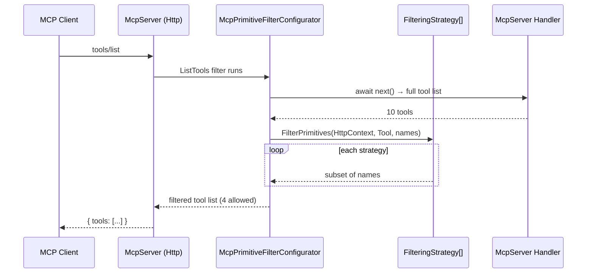
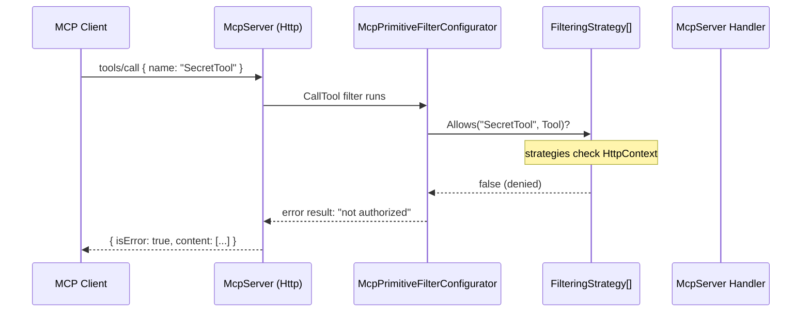
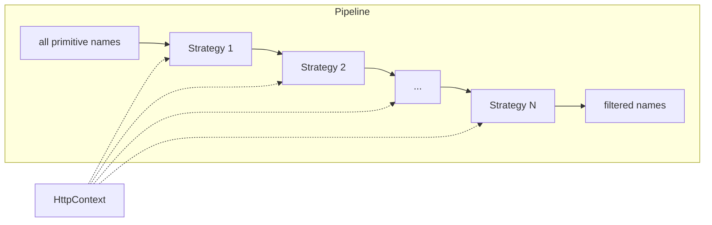
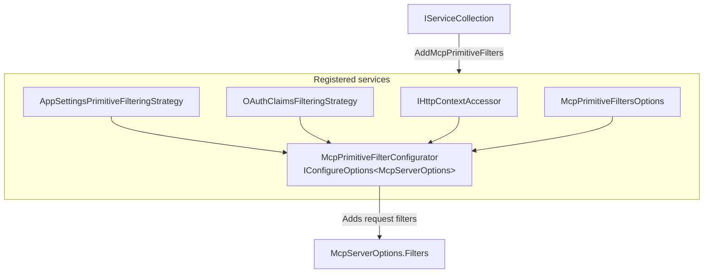

# McpPrimitiveFilters

Pluggable authorization filtering for MCP server **tools**, **resources**, and **prompts**. Attach one or more strategies to decide which primitives each authenticated (or anonymous) client can see and invoke.

## What it does

- Intercepts every `tools/list`, `tools/call`, `resources/list`, `resources/read`, `prompts/list`, and `prompts/get` request on your MCP server.
- Runs a pipeline of pluggable `McpPrimitiveFilteringStrategy` implementations — each receives the `HttpContext` and the list of primitive names, and returns the subset that is **allowed**.
- Comes with two built-in strategies: **appsettings allowlists** (for local/dev control) and **OAuth scope claims** (for enterprise authorization).
- You can add your own strategies by extending `McpPrimitiveFilteringStrategy`.

## Architecture

### Package surface

| Type | Role |
|---|---|
| `McpPrimitiveFilteringStrategy` | Abstract base — override `FilterTools`, `FilterResources`, `FilterPrompts` |
| `McpPrimitiveFilterConfigurator` | Wires strategies into `McpServerOptions` request filters |
| `McpPrimitiveFiltersOptions` | Toggles built-in strategies and per-primitive-type filtering |
| `McpPrimitiveFiltersExtensions` | `AddMcpPrimitiveFilters()` DI registration |
| `AppSettingsPrimitiveFilteringStrategy` | Allowlist from `IConfiguration` |
| `OAuthClaimsFilteringStrategy` | Allowlist from `scope` claims on the JWT bearer principal |

### Request flow





### Strategy pipeline



Each strategy takes the output of the previous one as its input — the pipeline narrows the allowlist. If any strategy returns an empty list, downstream strategies never run (the result is empty).

### Composition in the DI container



## Getting started

### 1. Install

Add the package and register it on your MCP server's service collection:

```csharp
using Microsoft.Extensions.DependencyInjection;

builder.Services.AddMcpPrimitiveFilters();
```

This registers the `IHttpContextAccessor`, both built-in strategies, and the configurator that attaches filters to the MCP server pipeline.

### 2. Configuration

All options live under `McpFiltering` in `appsettings.json`:

```jsonc
{
  "McpFiltering": {
    "Allowed": {
      "tools": ["GetRandomNumber", "Echo", "GetTimestamp"],
      "resources": ["Server Info", "Current Time"],
      "prompts": ["Greeting", "Help"]
    }
  }
}
```

For OAuth, configure scope claims on your identity provider. The strategy looks for:

| Scope claim | Effect |
|---|---|
| `mcp.tools.all` | Allows **all** tools |
| `mcp.resources.all` | Allows **all** resources |
| `mcp.prompts.all` | Allows **all** prompts |
| `mcp.tool.<name>` | Allows the named tool (e.g. `mcp.tool.GetRandomNumber`) |
| `mcp.resource.<name>` | Allows the named resource |
| `mcp.prompt.<name>` | Allows the named prompt |

If the client is **not authenticated**, the OAuth strategy passes through all names — it only filters when a principal is present.

### 3. Customize behaviour

```csharp
builder.Services.AddMcpPrimitiveFilters(options =>
{
    options.UseBuiltinAppSettingsFilteringStrategy = false; // only OAuth
    options.UseBuiltinOAuthClaimsFilteringStrategy = true;
    options.FilterTools = true;
    options.FilterResources = true;
    options.FilterPrompts = false;          // prompts are public
});
```

## Code examples

### AppSettings allowlist

The simplest setup — control everything from `appsettings.json`:

```csharp
var builder = WebApplication.CreateBuilder(args);
builder.Services.AddMcpPrimitiveFilters();
// ... register your tools, resources, prompts ...
var app = builder.Build();
app.MapMcp();
app.Run();
```

```jsonc
// appsettings.json
{
  "McpFiltering": {
    "Allowed": {
      "tools": ["Echo"],
      "resources": []
    }
  }
}
```

An empty allowlist array means *nothing is allowed*. Omitting the key or setting it to `null` means *everything is allowed*.

### OAuth scope-based filtering

Register filtering alongside your OAuth setup:

```csharp
var builder = WebApplication.CreateBuilder(args);

builder.Services.AddAuthentication(JwtBearerDefaults.AuthenticationScheme)
    .AddJwtBearer(/* your config */);
builder.Services.AddAuthorization();

builder.Services.AddMcpPrimitiveFilters(options =>
{
    options.UseBuiltinAppSettingsFilteringStrategy = false; // rely on scopes
    options.UseBuiltinOAuthClaimsFilteringStrategy = true;
});

var app = builder.Build();
app.UseAuthentication();
app.UseAuthorization();
app.MapMcp();
app.Run();
```

A client presenting a token with `scope: mcp.tool.Echo mcp.tool.Status` will only see and be able to call `Echo` and `Status`. Any other tool call returns an error with the message `"Tool 'X' is not authorized."`.

### Writing a custom strategy

Extend `McpPrimitiveFilteringStrategy` and register it in DI:

```csharp
public sealed class TimeBasedFilteringStrategy : McpPrimitiveFilteringStrategy
{
    protected override IEnumerable<string> FilterTools(
        HttpContext httpContext, IEnumerable<string> names)
    {
        // Only expose admin tools during business hours
        if (DateTime.Now.Hour is >= 9 and < 17)
            return names;
        return names.Where(n => !n.StartsWith("Admin", StringComparison.OrdinalIgnoreCase));
    }
}
```

```csharp
builder.Services.AddMcpPrimitiveFilters();
builder.Services.AddSingleton<McpPrimitiveFilteringStrategy, TimeBasedFilteringStrategy>();
```

All `McpPrimitiveFilteringStrategy` registrations are resolved as `IEnumerable<McpPrimitiveFilteringStrategy>` and run in registration order. Built-in strategies are registered as `TryAdd*` so your custom registration takes precedence when you use the same type.

## Logging

All strategy decisions are logged via `ILogger` under the category `McpPrimitiveFilters`:

| Level | Scenario |
|---|---|
| `Debug` | Per-primitive allow/deny, unauthenticated passthrough, scope details |
| `Information` | Wildcard scope grants, final allow/deny counts |
| `Warning` | Call denied at invocation time |

## License

MPL-2.0 — see the [LICENSE](../../LICENSE) file at the repository root.
